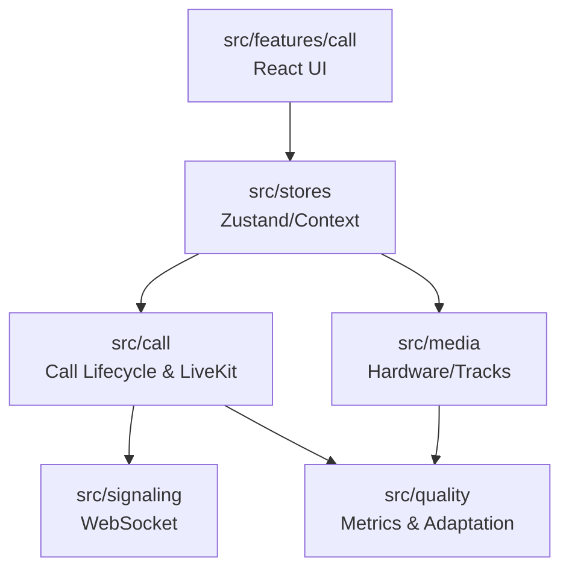

# Shroom Repository File Structure

This document outlines the architecture and file structure for **Shroom**, a lightweight, resilient video calling platform. 

The repository is structured as a **monorepo**, containing both the Go backend and the React/TypeScript frontend, along with shared deployment and tooling configuration.

## High-Level Monorepo Structure

```text
shroom/
├── .github/          # GitHub Actions CI/CD pipelines
├── .vscode/          # Shared editor configuration
├── backend/          # Go API, WebRTC signaling, and business logic
├── deploy/           # Infrastructure as Code (K8s, Terraform)
├── docker/           # Dockerfiles and container configurations
├── docs/             # Architecture and project documentation
├── frontend/         # React/TypeScript/Vite web application
└── scripts/          # Utility scripts for testing and automation
```

---

## 1. Frontend Architecture & Rationale

### Why Feature-Based + Extracted Core Modules?
The frontend abandons the traditional "layer-based" structure (where all components, hooks, and services live in flat, app-wide directories) in favor of a **feature-based** structure combined with **isolated domain modules**.

*   **Feature-based (`src/features/*`)**: UI components, pages, and feature-specific state are grouped by feature (e.g., `auth`, `lobby`, `call`). This prevents "file hunting" and naturally enforces encapsulation. A component in `home` should not import a component from `settings`.
*   **Isolated Domain Modules (`src/media`, `src/call`, `src/signaling`, `src/quality`)**: WebRTC, media constraints, and WebSocket signaling represent complex, async state machines that outlive any single React component's lifecycle. By extracting these into pure TypeScript classes/modules, we decouple our core business logic from React's render cycle. 
    *   *Alternative*: Wrapping WebRTC directly in React Context/Hooks. This typically leads to re-render hell, race conditions during unmounts, and logic that is impossible to test without a DOM environment.

### Frontend Core Domain Separation

To ensure resilience, the core mechanics of a video call are strictly partitioned:



*   **`src/media/`**: Manages `getUserMedia`, `MediaStreamTrack`, and device enumeration. **Must not know about:** React, WebSockets, or other users.
*   **`src/call/`**: Manages the room state, LiveKit room connections, and peer lifecycle. **Must not know about:** The DOM or React components.
*   **`src/signaling/`**: Handles the raw WebSocket transport and JSON encoding/decoding. **Must not know about:** Media tracks or UI state.
*   **`src/quality/`**: Polls `getStats()` and computes network scores. **Must not know about:** How to render the quality indicator.
*   **`src/features/call/`**: Pure React UI. **Must not know about:** Raw `RTCPeerConnection` or WebSocket instances. It only reacts to state changes emitted by the modules above.

---

## 2. Frontend Directory Reference (`frontend/`)

### `frontend/public/`
*   **Purpose:** Static assets served directly by the web server at the root path.
*   **Contains:** `favicon.ico`, `manifest.json`, static raw images.
*   **Does NOT Contain:** Compiled CSS, JS, or imported SVGs.
*   **Dependencies:** None.

### `frontend/src/`
*   **Purpose:** Root of the application source code.
*   **Contains:** Application entry points (`main.tsx`, `App.tsx`), global CSS.
*   **Interface:** `main.tsx` mounts the React tree to the DOM.

### `frontend/src/lib/`
*   **Purpose:** App-wide generic utilities and third-party library wrappers.
*   **Contains:** `api.ts` (fetch wrapper), `utils.ts` (Tailwind `cn()` merger).
*   **Does NOT Contain:** Domain-specific business logic.
*   **Dependencies:** External libraries (e.g., `clsx`, `tailwind-merge`).

### `frontend/src/hooks/`
*   **Purpose:** Shared, app-wide React hooks that span multiple features.
*   **Contains:** `use-auth.ts`, `use-network-quality.ts`.
*   **Does NOT Contain:** Feature-specific hooks (which go in `src/features/.../hooks/`).

### `frontend/src/stores/`
*   **Purpose:** Global state management (Zustand).
*   **Contains:** Authentication state, user preferences, and theme settings.
*   **Does NOT Contain:** Ephemeral UI state (like dropdown open/close).

### `frontend/src/features/`
*   **Purpose:** Groups UI code by functional domain to maximize cohesion.
*   **Contains:** Subdirectories like `auth`, `home`, `lobby`, `call`, `settings`. Each contains its own `components/` and `pages/`.
*   **Dependencies:** Depends on `src/lib`, `src/components/ui`, and core domain modules. Features should generally *not* depend on each other.

### `frontend/src/components/ui/`
*   **Purpose:** Highly reusable, dumb UI components (Design System / shadcn ui).
*   **Contains:** Buttons, inputs, dialogs, avatars.
*   **Does NOT Contain:** Any business logic, API calls, or state (other than internal UI state).
*   **Dependencies:** `src/lib/utils.ts`.

### `frontend/src/types/`
*   **Purpose:** Shared TypeScript interfaces and type definitions used across boundaries.
*   **Contains:** API response shapes, Room/User domain models.

### Key Frontend Files

#### `src/media/MediaManager.ts`
*   **Responsibility:** Acquires and holds local audio/video tracks. Handles permissions and device switching.
*   **Exports:** `MediaManager` class.
*   **Separation:** Must NOT know about `LiveKitClient` or React. Returns plain `MediaStreamTrack` objects that other modules consume.

#### `src/call/CallSession.ts`
*   **Responsibility:** Orchestrates the transition from Lobby -> Joining -> Connected -> Disconnected. Binds LiveKit events to the application state store.
*   **Exports:** `CallSession` class.
*   **Separation:** Must NOT touch the DOM. Must NOT make generic HTTP API calls (delegates to `api.ts`).

#### `src/signaling/SignalingClient.ts`
*   **Responsibility:** Maintains a resilient WebSocket connection with exponential backoff. Parses incoming frames and routes them as typed events.
*   **Exports:** `SignalingClient` class, `SignalingEvent` types.
*   **Separation:** Must NOT handle media tracks or WebRTC SDP processing. It is strictly a message transport layer.

#### `src/features/call/CallPage.tsx`
*   **Responsibility:** The main view for an active room. Wires the `CallSession` data to the `VideoGrid` and `ControlBar`.
*   **Exports:** Default React component.
*   **Separation:** Must NOT instantiate `WebSocket` or call `navigator.mediaDevices` directly.

---

## 3. Backend Directory Reference (`backend/`)

The backend follows Standard Go Project Layout, utilizing `cmd/` for executables and `internal/` for private application code, organized by domain.

### `backend/cmd/`
*   **Purpose:** Entry points for all executables in the Go project.
*   **Contains:** Minimal `main.go` files that just parse flags, wire dependencies, and start a service.
*   **Dependencies:** `backend/internal/...`

### `backend/internal/`
*   **Purpose:** Code that is completely private to this application and cannot be imported by external Go projects.

### `backend/internal/config/`
*   **Purpose:** Application configuration and environment variable parsing.
*   **Contains:** Struct definitions mapping to `.env` variables (e.g., `type Config struct`).

### `backend/internal/server/`
*   **Purpose:** HTTP server lifecycle and top-level middleware.
*   **Contains:** Route registration, CORS, global rate limiting, and panic recovery.
*   **Does NOT Contain:** Business logic or specific HTTP handlers.
*   **Dependencies:** Depends on all feature domains (to register their routes).

### `backend/internal/auth/`
*   **Purpose:** User authentication, JWT management, and password hashing.
*   **Contains:** Handlers, Services, and DB Store specifically for `users` and `sessions` tables.
*   **Interface:** Exposes `auth.Service` interface (e.g., `Login(email, pw)`, `ValidateToken(jwt)`).

### `backend/internal/room/`
*   **Purpose:** Room lifecycle management (creation, state transitions, validation).
*   **Contains:** Logic to generate 8-char short IDs, check room capacity, and mint LiveKit tokens.
*   **Dependencies:** Depends on `internal/db` and `internal/redis` for state persistence.

### `backend/internal/ws/`
*   **Purpose:** WebSocket connection management and room-based pub/sub routing.
*   **Contains:** Connection upgrader, read/write pumps, and the connection `Hub`.
*   **Does NOT Contain:** Specific business rules for WebRTC signaling (delegates to `signal`).
*   **Interface:** Exposes `ws.Hub` for broadcasting messages to specific `room_id` channels.

### `backend/internal/signal/`
*   **Purpose:** Shroom's custom signaling relay and LiveKit SDK integration.
*   **Contains:** Logic to exchange custom events (e.g., raise hand, chat) and interface with LiveKit's Server API to mutate room state.
*   **Dependencies:** Depends on `ws.Hub` to send messages to clients.

### `backend/internal/quality/`
*   **Purpose:** Ingestion and analysis of client-reported network quality telemetry.
*   **Contains:** Endpoints to batch-receive quality scores, alerting thresholds, and TSDB persistence.

### `backend/internal/redis/`
*   **Purpose:** Distributed state management for scaling horizontally.
*   **Contains:** Redis client wrappers for cross-node presence tracking and pub/sub.
*   **Does NOT Contain:** HTTP handlers.

### `backend/internal/db/`
*   **Purpose:** PostgreSQL connection pooling and transaction management.
*   **Contains:** `db.go` (pgxpool initialization) and `queries.go` (shared SQL utilities).

### `backend/migrations/`
*   **Purpose:** SQL files for database schema migrations.
*   **Contains:** `.up.sql` and `.down.sql` pairs executed by golang-migrate.

### `backend/tests/`
*   **Purpose:** Integration and end-to-end tests for the backend.
*   **Contains:** Setup helpers, database test containers, and domain-spanning test suites.
*   **Does NOT Contain:** Unit tests (which live alongside the code, e.g., `auth/jwt_test.go`).

### Key Backend Files

#### `backend/main.go`
*   **Responsibility:** The primary entry point. Initializes config, establishes DB/Redis connections, builds the dependency injection graph, and starts the HTTP server.
*   **Separation:** Must NOT contain HTTP handler implementations or SQL queries.

#### `backend/internal/ws/hub.go`
*   **Responsibility:** Thread-safe registry of all active WebSocket connections. Maps connections to user IDs and room IDs.
*   **Exports:** `type Hub struct`, `Run()`, `BroadcastToRoom()`.
*   **Separation:** Must NOT decode specific signaling JSON payloads. It only knows about `[]byte` and connection IDs.

#### `backend/internal/room/service.go`
*   **Responsibility:** Business logic for rooms. E.g., preventing a room from being joined if its state is "ended".
*   **Exports:** `type Service interface`.
*   **Separation:** Must NOT write HTTP responses directly. Returns standard Go `error` types that handlers translate to 400/500 HTTP codes.

---

## 4. Infrastructure, Scripts, and CI

### `docker/`
*   **Purpose:** Container configurations for local development and base images for production.
*   **Contains:** Multi-stage `Dockerfile`s optimized for caching and small image sizes. `nginx.conf` for local reverse proxying.

### `scripts/`
*   **Purpose:** Developer utilities and operational tools.
*   **Contains:** `network-sim.sh` (wraps `tc` to simulate packet loss/latency on local interfaces for testing adaptive bitrate), `seed-db.sh`.
*   **Does NOT Contain:** Application source code.

### `deploy/`
*   **Purpose:** Infrastructure definition (GitOps target directory).
*   **Contains:** Kubernetes YAML manifests and Terraform scripts.

### `.github/workflows/`
*   **Purpose:** CI/CD pipeline definitions.
*   **Contains:** `ci.yml` (Runs `go test`, `vitest`, `eslint`, `golangci-lint`), `deploy.yml` (Builds and pushes Docker images on tag).
